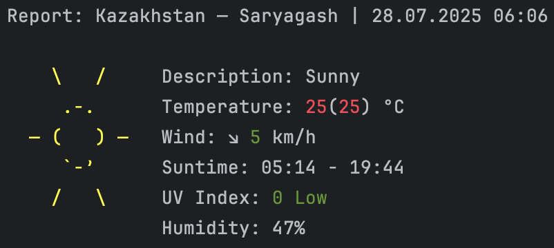

# Sunny
### Table of Contents
- **[Installation](#installation)**
- **[Configuration](#configuration)**
- **[Command Line Args](#command-line-args)**
- **[Architecture](#architecture)**

### Example:
[](img/example.png)

### Features
- **Get current weather from `wttr.in`**
- **ASCII-based weather art**
- **Configurable with `config.toml`**
- **Fast, built with Rust**
- **CLI support with args**

---
## Installation
### From source
1. Clone the repository:
```shell
git clone https://github.com/bkoshik/Sunny.git
cd Sunny
```

2. Build the project
```shell
cargo build --release
```

---
## Configuration
### Place:
- **Linux:** `~/.config/sunny/config.toml`
- **macOS:** `~/Library/Application\ Support/sunny/config.toml`
- **Windows:** `C:\Users\[User]\AppData\Roaming\sunny\config.toml`

### Options:
- `city`: The city for fetching weather data
- `units`: Units for temperature and wind speed
    - metric
    - imperial

### Example:
```toml
city = "Saryagash"
units = "metric"
```

---
## Command Line Args
### Options:
- `--city [city_name]`: The city for fetching weather data
- `--units {metric/imperial}`: Units for temperature and wind speed
  - metric
  - imperial

### Example:
```shell
sunny --city Saryagash --units metric
```

---
## Architecture
### System
- **OS:** `Apple macOS`
- **IDE:** `JetBrains RustRover`
- **Language:** `Rust`
- **Build System:** `Cargo`

### File System
```text
sunny
├── Cargo.lock
├── Cargo.toml
├── img
│   └── example.png
├── LICENSE
├── README.md
└── src
    ├── main.rs
    └── modules
        ├── ascii_art.rs
        ├── ascii_arts_db.rs
        ├── config.rs
        ├── fetch_weather.rs
        ├── fmt_lines.rs
        ├── mod.rs
        └── weather.rs
```